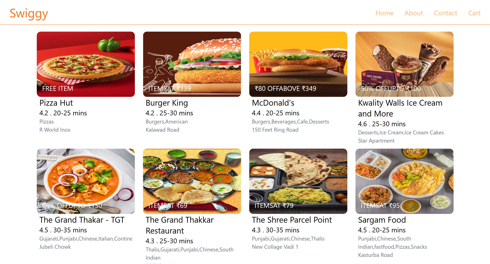

# 🍔 Swiggy Clone - React Project

This is a **Swiggy Clone** built using **React** (Functional Components), implementing routing, state management, and API integration. The application replicates the basic structure and functionality of Swiggy’s food delivery platform.

## 🚀 Features

- 🔄 React Functional Components with Hooks Likes `useState` and `useEffect`
- 🌐 React Router for navigation
- 🗃️ One Class Component using the GitHub API (for demonstration)
- 🍽️ Restaurant listing & menu simulation
- 🔍 Search functionality
- ❤️ Add to Favorites / Cart (basic state-based simulation)
- ✨ Shimmer UI

## 🛠️ Tech Stack

- React  
- React Router DOM  
- JavaScript (ES6+)  
- HTML & CSS (or your preferred styling approach)  
- GitHub API (for demo Class Component)  
- Fake/Static JSON or Local API for restaurants & menu data  

## 🧑‍💻 How to Run Locally

1. **Clone the repository:**

```bash
git clone https://github.com/Avnit2303/swiggy-clone.git
cd swiggy-clone
npm install
npm start
```

## 📸 Screenshot


